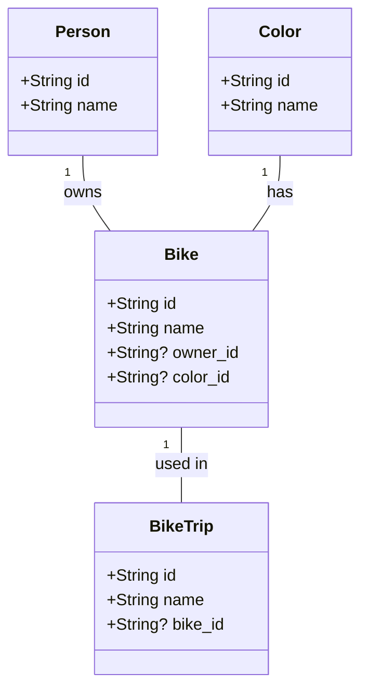

# Data Model

The data model for the Pedal Pal application consists of the following entities:

1. Person: Represents individuals who own bikes.
2. Color: Represents colors available for bikes.
3. Bike: Represents individual bikes, associated with an owner (Person) and a color.
4. BikeTrip: Represents a trip taken by a bike.

## Entity Relationships

## Entity Details

### Person
- Represents an individual who can own bikes.
- Fields:
  - id: Unique identifier (Text)
  - name: Person's name (Text)

### Color
- Represents a color that can be applied to bikes.
- Fields:
  - id: Unique identifier (Text)
  - name: Color name (Text)

### Bike
- Represents a bicycle that can be owned by a person and have a color.
- Fields:
  - id: Unique identifier (Text)
  - name: Bike's name or description (Text)
  - owner_id: Optional reference to the Person who owns the bike (Nullable Text)
  - color_id: Optional reference to the Color of the bike (Nullable Text)

### BikeTrip
- Represents a trip taken by a bike.
- Fields:
  - id: Unique identifier (Text)
  - name: Trip's name or description (Text)
  - bike_id: Optional reference to the Bike used for the trip (Nullable Text)

Note: All relationships between entities are optional (using Nullable fields) to allow for flexibility in data entry and representation of partial information.

## Relationships

1. A Bike can be owned by one Person (optional).
2. A Bike can have one Color (optional).
3. A BikeTrip can be associated with one Bike (optional).

The schema allows for queries that join these tables together, as indicated by the `joinable!` and `allow_tables_to_appear_in_same_query!` macros in the schema definition.
